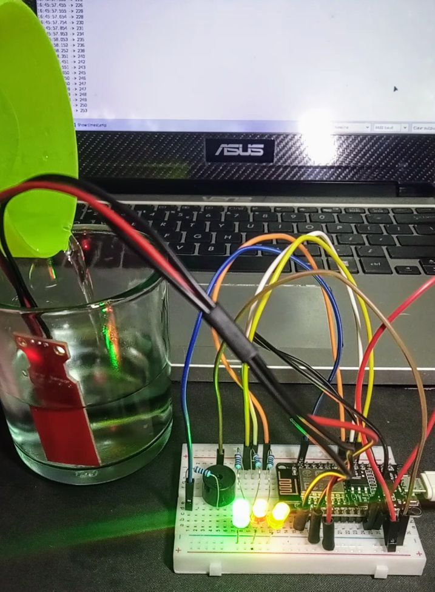

# Water Level Monitoring System

## Video Demonstration
Check this out [Video Demonstration](https://www.dropbox.com/scl/fi/8knbag176snb00uf8w07s/VID20231107164538.mp4?rlkey=ua5hv7ji5qux2jhsfq3h2pl7u&st=ghrovdqh&dl=0)

- This is a simple water level monitoring system using a NodeMCU ESP-12E, water level sensor, LED's and Buzzer. The system uses LEDs to indicate different water levels and a buzzer for additional alerts.

## How It Works
- The system works by continuously reading the analog value from the water level sensor, which is connected to pin A0. The water level sensor provides varying analog readings based on the water level it is exposed to.

- The code sets predefined threshold values (130, 180, 220, 235) to categorize different water levels. Depending on the analog reading, the system illuminates different LEDs and activates the buzzer to visually and audibly indicate the current water level.

## License

This project is licensed under the MIT License. See the [LICENSE](LICENSE) file for details.

